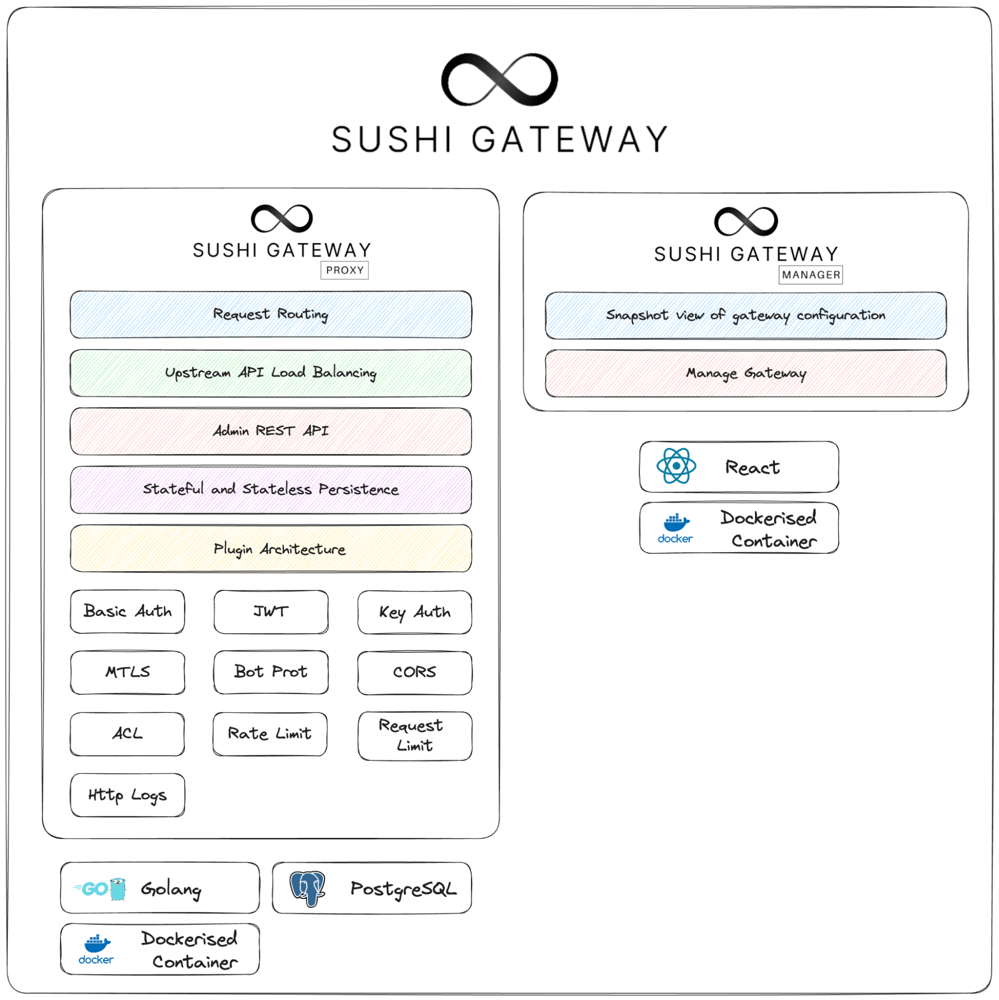
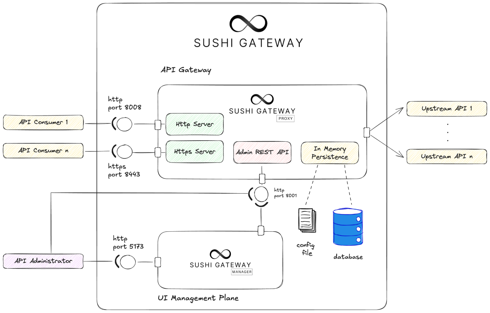

# Sushi Gateway


Sushi Gateway is a highly configurable Layer 7 API gateway designed with modularity at its core.
The name "Sushi" reflects its layered, customizable nature, as each "piece" can represent a distinct
middleware layer or policy, much like individual sushi components. This modularity allows users to
add, remove, or adjust functionalities easily through configurable plugins, tailoring the gateway to
meet specific needs. On the other hand, the Infinity symbol represents an infinite amount of API
policy customization, allowing administrators to tailor fine-grained policies.

## Components



Sushi Gateway contains two components: `Sushi Proxy` and `Sushi Manager`.

| Component     | Function                                                                                                                                              |
| ------------- | ----------------------------------------------------------------------------------------------------------------------------------------------------- |
| Sushi Proxy   | The core API Gateway functionality handling API request routing, load balancing, and the modular plugin architecture, enabling configurable policies. |
|               |
| Sushi Manager | Frontend interface to allow administrators to view and manage gateway configurations.                                                                 |
|               |

## Architecture



Sushi Gateway is a lightweight Layer 7 API gateway built in Golang that serves HyperText Transfer Protocol (HTTP) or HyperText Transfer Protocol Secure (HTTPS) traffic.

By operating in Layer 7 of the OSI (Application Layer) and serving HTTP/HTTPS traffic, the gateway is able to make intelligent decisions based on the specifics of each API call, such as the host and port, URL paths, HTTP methods, and HTTP headers. This capability enables advanced functionalities like load balancing and enforcing policies, catered to the intent of the traffic.

The gateway also offers two data persistence options: stateful (using a database or “db”) and stateless (database-less or “dbless”). Data will either be loaded from a configuration manifest file in the case of a stateless configuration or synced from a database in the case of a stateful configuration. It will then be stored inside the gateway instance in-memory.

The Admin API serves as an internal interface for managing the gateway. Administrators can use the Admin API to configure and monitor various aspects of the gateway, such as applying policies, adjusting settings, and directing log traffic. Sushi Manager also relies on the Admin API to retrieve and display gateway data, enabling admins to view and manage configurations through a unified interface.

### Services

| Service       | Port                      | Description                                       |
| ------------- | ------------------------- | ------------------------------------------------- |
| Sushi Proxy   | `8008(http), 8443(https)` | Exposes the API Gateway to the public.            |
| Admin API     | `8001`                    | Exposes API Gateway information to the UI Manager |
| Sushi Manager | `5173`                    | Exposes the UI Manager                            |

## Available Plugins

| Plugin             | Type            | Description                                                       |
| ------------------ | --------------- | ----------------------------------------------------------------- |
| Acl                | Traffic Control | Access Control List to allow or deny requests based on IP address |
| Basic Auth         | Auth            | Basic Authentication                                              |
| Bot Protection     | Security        | Protects against bot attacks                                      |
| Cors               | Security        | Cross-Origin Resource Sharing                                     |
| Jwt                | Auth            | Json Web Token Authentication                                     |
| Key Auth           | Auth            | Key Authentication                                                |
| Mtls               | Auth            | Mutual TLS Authentication                                         |
| Rate Limit         | Traffic Control | Limit number of requests to upstreams                             |
| Request Size Limit | Traffic Control | Limit the size of the request body                                |
| Http Log           | Logging         | Log HTTP requests                                                 |

## GETTING STARTED

### Quick Start using docker

1. Pull the proxy and manager image from dockerhub.

```bash
docker pull rawsashimi/sushi-proxy:latest
docker pull rawsashimi/sushi-manager:latest
```

2. Create a config.json file with the following values

```json
{
  "global": {
    "name": "example-gateway",
    "plugins": []
  },
  "services": [
    {
      "name": "example-service",
      "base_path": "/example",
      "protocol": "http",
      "load_balancing_strategy": "round_robin",
      "upstreams": [
        { "id": "upstream_1", "host": "example-app", "port": 3000 }
      ],
      "routes": [
        {
          "name": "example-route",
          "path": "/v1/sushi",
          "methods": ["GET"],
          "plugins": [
            {
              "id": "example-plugin",
              "name": "rate_limit",
              "enabled": true,
              "config": {
                "limit_second": 10,
                "limit_min": 10,
                "limit_hour": 100
              }
            }
          ]
        }
      ]
    }
  ]
}
```

3. Create a docker network

```bash
docker network create sushi-network
```

4. Create an API upstream, for this case, we wil use an example node.js service.

```bash
docker pull rawsashimi/express-sushi-app:latest
```

5. Run the example node.js container with the required environment variables.

```bash
docker run -d \
--name example-app \
--network sushi-network \
-e APP_ID=3000 \
-e JWT_ISSUER=someIssuerKey \
-e JWT_SECRET=123secret456 \
-p 3000:3000 \
rawsashimi/express-sushi-app:latest
```

6. Test that the service works

```bash
curl http://localhost:3000/v1/sushi | jq


```

You should receive a response:

```json
{
  "app_id": "3000",
  "data": [
    {
      "id": 1,
      "name": "California Roll",
      "ingredients": ["Crab", "Avocado", "Cucumber"]
    },
    {
      "id": 2,
      "name": "Tuna Roll",
      "ingredients": ["Tuna", "Rice", "Nori"]
    }
  ]
}
```

7. Create the CA, self-signed cert and key for the proxy.

- The CA is used for authenticating MTLS requests
- The cert and key is used to host Sushi Proxy in HTTPs

```bash
# Generate ca private key
openssl genrsa -out ca.key 4096
# Generate self signed CA cert
openssl req -new -x509 -days 3650 -key ca.key -out ca.crt

# Generate server private key
openssl genrsa -out server.key 2048
# Generate server CSR
openssl req -new -key server.key -out server.csr

# Create Server certificate signed by your CA
printf "[req_ext]\nsubjectAltName=DNS:localhost" > extfile.cnf
openssl x509 -req -days 365 -in server.csr -CA ca.crt -CAkey ca.key -CAcreateserial -out server.crt \
-extensions req_ext -extfile extfile.cnf

# Verify Certs
openssl verify -CAfile ca.crt server.crt
```

8. Run the sushi proxy container with the required environment variables.

```bash
docker run \
--rm \
--name example-proxy \
--network sushi-network \
-v $(pwd)/config.json:/app/config.json \
-v $(pwd)/server.crt:/app/server.crt \
-v $(pwd)/server.key:/app/server.key \
-v $(pwd)/ca.crt:/app/ca.crt \
-e CONFIG_FILE_PATH="/app/config.json" \
-e SERVER_CERT_PATH="/app/server.crt" \
-e SERVER_KEY_PATH="/app/server.key" \
-e CA_CERT_PATH="/app/ca.crt" \
-e ADMIN_USER=admin \
-e ADMIN_PASSWORD=changeme \
-e PERSISTENCE_CONFIG=dbless \
-p 8008:8008 \
-p 8081:8081 \
-p 8443:8443 \
rawsashimi/sushi-proxy:latest
```

9. Test that the proxy works

```bash
curl http://localhost:8008/example/v1/sushi | jq
```

You will get the response:

```json
{
  "app_id": "3000",
  "data": [
    {
      "id": 1,
      "name": "California Roll",
      "ingredients": ["Crab", "Avocado", "Cucumber"]
    },
    {
      "id": 2,
      "name": "Tuna Roll",
      "ingredients": ["Tuna", "Rice", "Nori"]
    }
  ]
}
```

10. Run Sushi Manager - an interactive UI used to view the gateway configuration.

```bash
docker run --rm -p 5173:5173 \
-e SUSHI_MANAGER_BACKEND_API_URL=http://localhost:8081 \
rawsashimi/sushi-manager:latest
```

Congrats!! you have created your first proxy service!

## TODO LIST

- [x] design database schema
- [x] provide database configuration options ( env variables to inject database env in )
- [x] sushi manager update logo
- [x] Logout endpoint to delete httponly cookie
- [x] sushi manager update gateway state to get types and also domain object to retrieve from gateway state.
- [x] sushi manager create screens
- [ ] Add gateway metadata (last configuration update, total requests)
  - [ ] gateway logs middleware
- [ ] Add stateful gateway configurations (good to have)
  - [x] Postgres DB (Externalise option)
  - [x] Postgres DB docker
  - [x] Admin API for CRUD operations
  - [x] global domain object config state retrieval from db.
  - [ ] add time created and time updated to schema.
  - [x] add simple gateway table to store gateway configurations.
- [x] Update readme with latest architecture diagrams and logos
- [x] Add CI github actions
- [x] Add CD for each release to push to dockerhub
- [ ] Add more tests for each plugin
  - [x] Acl
  - [x] Basic auth
  - [x] Bot protection
  - [x] Cors
  - [x] Jwt
  - [x] Key auth
  - [ ] Mtls
  - [x] Rate limit
  - [x] Request size limit
  - [ ] Http log
- [x] Finish up plugins
- [x] Add "enabled" field to plugins (common middleware for all plugins)
- [ ] Add validation schema for each plugin, that is validated at config file load time (good to have)
  - [ ] General architecture
  - [ ] Acl
  - [ ] Basic auth
  - [ ] Bot protection
  - [ ] Cors
  - [ ] Jwt
  - [ ] Key auth
  - [ ] Mtls
  - [ ] Rate limit
  - [ ] Request size limit
  - [ ] Http log
- [x] Add dynamic routing (route parameters like {id}, {anything})
- [ ] Add more tests for the proxy
- [x] Dockerizing proxy
- [ ] Create kube deployment (helm)
- [ ] Load balancing to upstreams
  - [x] Round robin
  - [ ] IP hash
  - [ ] Weighted
- [ ] Configure health checks for upstreams (good to have)
- [x] UI Portal development and design
  - [x] Update UI Portal to show services, routes, upstreams etc...
  - [ ] Update UI Portal to interface with Admin API
- [x] Flatten file structure, cyclic imports

## TLS

https/tls support has been added to the proxy, add cert and key into environment variables to use.

## Start a database

create a postgres database.

- `docker run --name postgres-db -e POSTGRES_PASSWORD=mysecretpassword -p 5432:5432 -d postgres`
- `docker exec -it postgres-db psql -U postgres -d sushi`
- `CREATE DATABASE sushi;`
- `\c sushi`
- `docker cp init.sql postgres-db:/init.sql`
- `docker exec -it postgres-db psql -U postgres -d sushi -f /init.sql`
- `docker cp mock.sql postgres-db:/mock.sql`
- `docker exec -it postgres-db psql -U postgres -d sushi -f /mock.sql`
- `\c`

## Plugins

- Auth
  - **(DONE)** basic auth
  - **(DONE)** jwt (only Hs256, Rs256 tbd)
  - **(DONE)** key auth
  - **(DONE)** mtls
- Security
  - **(DONE)** bot_protection
  - **(DONE)** cors
- Traffic Control
  - **(DONE)** acl
  - **(DONE)** rate limit
  - **(DONE)** request size limit
- Logging and metrics
  - **(DONE)** http log
