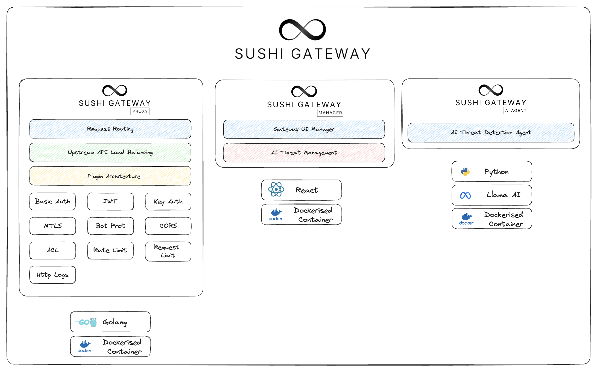
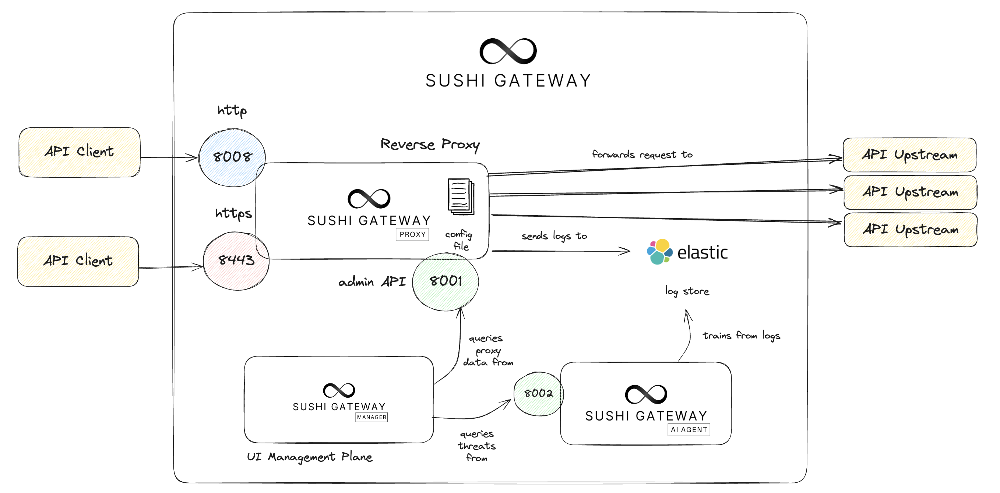

# Sushi Gateway

Sushi Gateway is a lightweight Layer 7 API Gateway used to route, secure, log and learn traffic to your services. It is designed to be simple to use and easy to configure.
It is built on top of Golang and incorporates a plugin architecture,
allowing you to extend the gateway with your policies of your choice. It also incorporates an AI-driven component that can learn traffic patterns and detects anamolies for you.

## Components

Sushi Gateway contains three components: `Sushi Proxy`, `Sushi Manager` and `Sushi AI Agent`.

| Component      | Function                                                                                                                                                                                                              |
| -------------- | --------------------------------------------------------------------------------------------------------------------------------------------------------------------------------------------------------------------- |
| Sushi Proxy    | Contains all the backend logic related to API request routing, upstream API load balancing, as well as the modular plugin architecture, which allows configurable policies/plugins to be attached to the API gateway. |
| Sushi Manager  | The frontend user interface to view gateway information and metrics, as well as interface to manage threats detected by Sushi AI Agent.                                                                               |
| Sushi AI Agent | AI Model to learn and detect threats provided by Sushi Proxy logs. It learns and detects threats and classifies them into different levels.                                                                           |

## Architecture

### Services

| Service        | Port                      | Description                                       |
| -------------- | ------------------------- | ------------------------------------------------- |
| Sushi Proxy    | `8008(http), 8443(https)` | Exposes the API Gateway to the public.            |
| Admin API      | `8001`                    | Exposes API Gateway information to the UI Manager |
| Sushi Manager  | `5173`                    | Exposes the UI Manager                            |
| Sushi AI Agent | `8002`                    | Exposes the AI Agent to the UI Manager            |

Sushi Proxy is exposed on 2 ports publicly: `8008 for HTTP requests` as well as `8443 for
HTTPS requests`. API Clients can connect to the gateway via these ports, where their
requests will be forwarded to the respective API upstream services.

The gateway can be configured via a JSON file which will be mounted onto it on startup and reload.

Furthermore, `there is also an admin API exposed on port 8001 for internal usage`. This
exposes an interface for the UI Manager to connect to retrieve gateway data.

When the gateway is processing requests, logs are also sent to an Elastic server to be
used for log storage. The AI Agent can then query the logs from the log server to
periodically check whether there any anomalies in the data.

Furthermore, any anomalies can be queried from the UI Manager via `port 8002 which will be exposed by the AI Agent`
web application.

## Available Plugins

| Plugin             | Type            | Description                                                       |
| ------------------ | --------------- | ----------------------------------------------------------------- |
| Acl                | Traffic Control | Access Control List to allow or deny requests based on IP address |
| Basic Auth         | Auth            | Basic Authentication                                              |
| Bot Protection     | Security        | Protects against bot attacks                                      |
| Cors               | Security        | Cross-Origin Resource Sharing                                     |
| Jwt                | Auth            | Json Web Token Authentication                                     |
| Key Auth           | Auth            | Key Authentication                                                |
| Mtls               | Auth            | Mutual TLS Authentication                                         |
| Rate Limit         | Traffic Control | Limit number of requests to upstreams                             |
| Request Size Limit | Traffic Control | Limit the size of the request body                                |
| Http Log           | Logging         | Log HTTP requests                                                 |

## GETTING STARTED

### docker-compose

- Go to `docker` folder
- Ensure have required TLS certs
- Run `docker compose up`

## TODO LIST

- [x] sushi manager update logo
- [ ] sushi manager update gateway state to get types and also domain object to retrieve from gateway state.
- [ ] sushi manager create screens
- [ ] Add gateway metadata (last configuration update, total requests)
  - [ ] gateway logs middleware
- [ ] Add stateful gateway configurations (good to have)
  - [ ] Postgres DB (Externalise option)
  - [ ] Postgres DB docker
  - [ ] Admin API for CRUD operations
  - [ ] global domain object config state retrieval from db.
- [ ] Update readme with latest architecture diagrams and logos
- [ ] Add CI github actions
- [ ] Add CD for each release to push to dockerhub
- [ ] Add more tests for each plugin
  - [x] Acl
  - [x] Basic auth
  - [x] Bot protection
  - [x] Cors
  - [ ] Jwt
  - [x] Key auth
  - [ ] Mtls
  - [x] Rate limit
  - [x] Request size limit
  - [ ] Http log
- [x] Finish up plugins
- [x] Add "enabled" field to plugins (common middleware for all plugins)
- [ ] Add validation schema for each plugin, that is validated at config file load time
  - [ ] General architecture
  - [ ] Acl
  - [ ] Basic auth
  - [ ] Bot protection
  - [ ] Cors
  - [ ] Jwt
  - [ ] Key auth
  - [ ] Mtls
  - [ ] Rate limit
  - [ ] Request size limit
  - [ ] Http log
- [x] Add dynamic routing (route parameters like {id}, {anything})
- [ ] Add more tests for the proxy
- [x] Dockerizing proxy
- [ ] Create kube deployment (helm)
- [x] Admin API development and design
- [ ] Load balancing to upstreams
  - [x] Round robin
  - [ ] IP hash
  - [ ] Weighted
- [ ] Configure health checks for upstreams (good to have)
- [x] UI Portal development and design
  - [ ] Update UI Portal to show services, routes, upstreams etc...
- [ ] AI Component development and design
- [x] Flatten file structure, cyclic imports
- [ ] Add elastic logs support

## TLS

https/tls support has been added to the proxy, add cert and key into environment variables to use.

## Plugins

- Auth
  - **(DONE)** basic auth
  - **(DONE)** jwt (only Hs256, Rs256 tbd)
  - **(DONE)** key auth
  - **(DONE)** mtls
- Security
  - **(DONE)** bot_protection
  - **(DONE)** cors
- Traffic Control
  - **(DONE)** acl
  - **(DONE)** rate limit
  - **(DONE)** request size limit
- Logging and metrics
  - **(DONE)** http log
