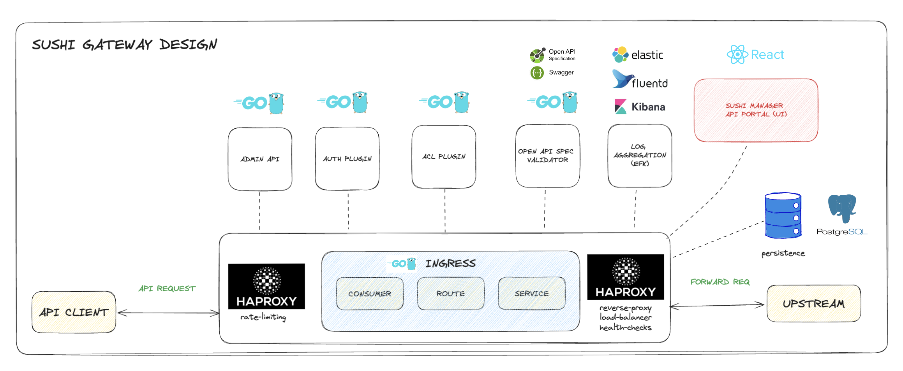

# Sushi Gateway

## GETTING STARTED

### docker-compose

- Go to `docker` folder
- Ensure have required TLS certs
- Run `docker compose up`

## TODO LIST

- [ ] Add more tests for each plugin
- [x] Finish up plugins
- [x] Add "enabled" field to plugins (common middleware for all plugins)
- [ ] Add validation schema for each plugin, that is validated at config file load time
- [ ] Add dynamic routing (route parameters like :id, :anything)
- [ ] Add more tests for the proxy
- [x] Dockerizing proxy
- [ ] Create kube deployment (helm)
- [ ] Admin API development and design
- [ ] UI Portal development and design
- [ ] AI Component development and design
- [ ] Flatten file structure, cyclic imports

## Llama

- get the llama model

## TLS

https/tls support has been added to the proxy, add cert and key into environment variables to use.

## Plugins

- Auth
  - **(DONE)** basic auth
  - **(DONE)** jwt (only Hs256, Rs256 tbd)
  - **(DONE)** key auth
    - oauth2
  - **(DONE)** mtls
- Security
  - **(DONE)** bot_protection
  - **(DONE)** cors
- Traffic Control
  - **(DONE)** acl
  - **(DONE)** rate limit
  - **(DONE)** request size limit
  - proxy_buffering
- Logging and metrics
  - OpenTelemetry
  - **(DONE)** http log
  - kafka log
